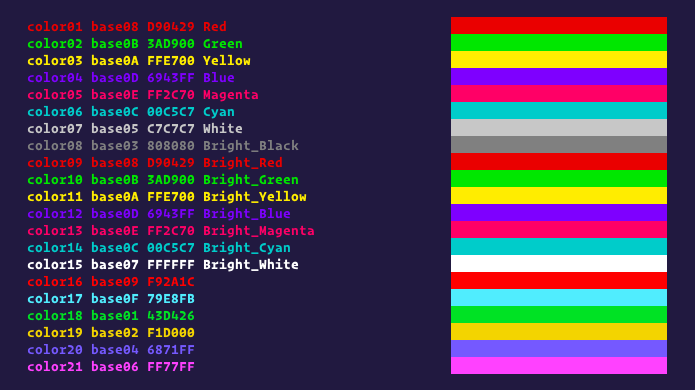

  

<h1 align="center">Shades of Purple for Base16</h1>
<h5 align="center">Base16 color scheme based on the amazing VSCode theme <a href="https://github.com/ahmadawais/shades-of-purple-vscode">Shades of Purple</a> by <a href="https://github.com/ahmadawais">Ahmad Awais</a>.</h5>
 

  
  
  
  
  

 

  <a href="https://github.com/demartini/base16-shades-of-purple/issues">Report Bug</a>
  -
  <a href="https://github.com/demartini/base16-shades-of-purple/issues">Request Feature</a>

## Table of Contents

- [Table of Contents](#table-of-contents)
- [Screenshots](#screenshots)
- [Installation](#installation)
- [Roadmap](#roadmap)
- [Contributing](#contributing)
  - [Contributors](#contributors)
- [Inspired By](#inspired-by)
- [Thanks To](#thanks-to)
- [Changelog](#changelog)
- [License](#license)

## Screenshots

  

## Installation

1. Install a [base16 builder](https://github.com/chriskempson/base16#builder-repositories). I like [pybase16](https://github.com/InspectorMustache/base16-builder-python), so this is what we're going to use in these instructions.
2. Make a folder to hold all the builder's files. For example: `~/base16`.
3. In that folder, run `pybase16 update`. This will download all of the official base16 [schemes](https://github.com/chriskempson/base16#scheme-repositories) and [templates](https://github.com/chriskempson/base16#template-repositories).
4. Now that all of the official [schemes](https://github.com/chriskempson/base16#scheme-repositories) and [templates](https://github.com/chriskempson/base16#template-repositories) have been downloaded, run `pybase16 build -s shades-of-purple`.
5. There will now be an `output` folder with all of the generated themes for various applications.

Alternatively, if you don't want to mess with the builders, I went ahead and generated all the output themes and sent them to another repository [here](https://github.com/demartini/base16-shades-of-purple-exported-themes).

## Roadmap

See the [open issues](https://github.com/demartini/base16-shades-of-purple/issues) for a list of proposed features (and known issues).

## Contributing

If you are interested in helping contribute, please take a look at our [Contributing](CONTRIBUTING.md) guide.

### Contributors

## Inspired By

- The amazing VSCode theme [Shades of Purple](https://github.com/ahmadawais/shades-of-purple-vscode) by [Ahmad Awais](https://github.com/ahmadawais).

## Thanks To

- [Chris Kempson](https://github.com/chriskempson/base16) for the logo.
- [Alex Meyer](https://github.com/reyemxela/base16-helios-scheme) for the installation instructions.

## Changelog

See [Changelog](CHANGELOG.md) for a human-readable history of changes.

## License

Distributed under the MIT License. See [LICENSE](LICENSE) for more information.